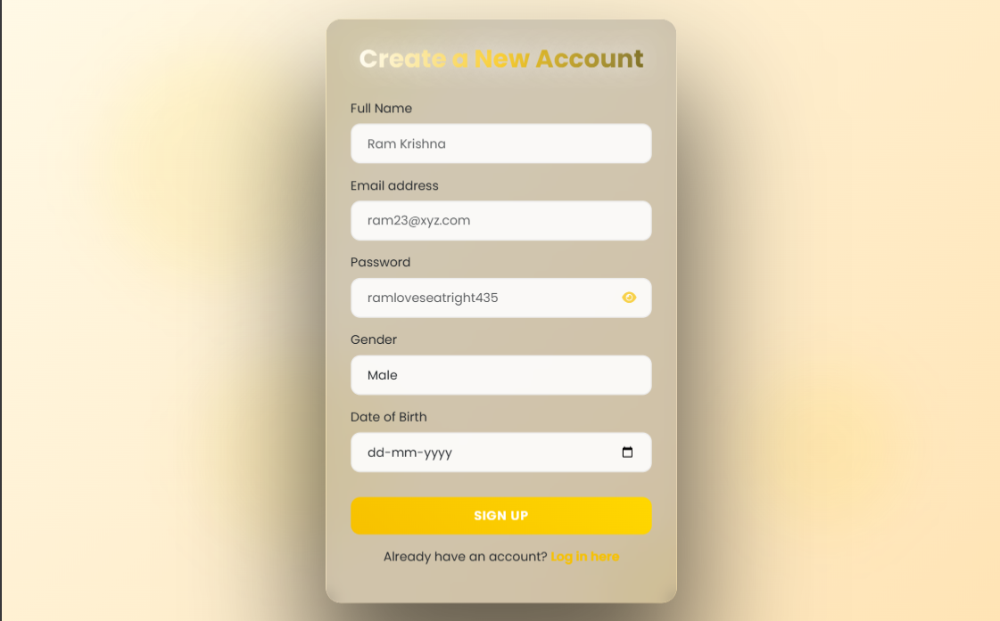
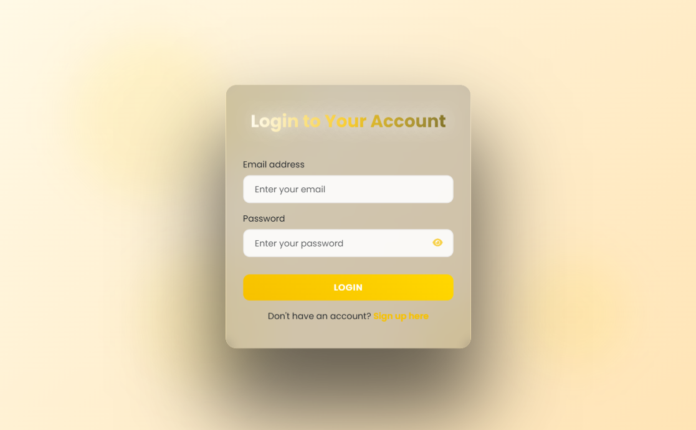
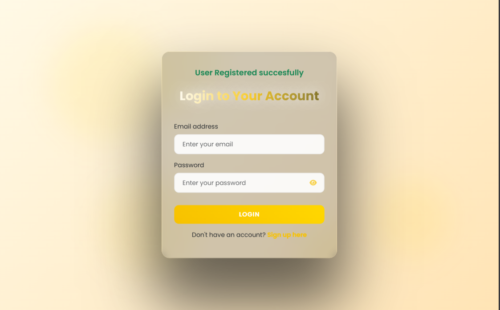
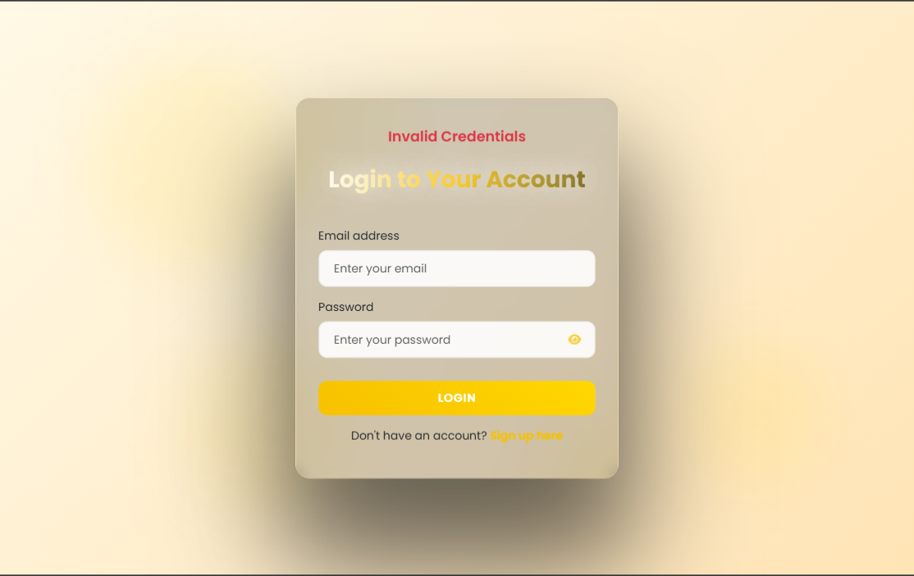
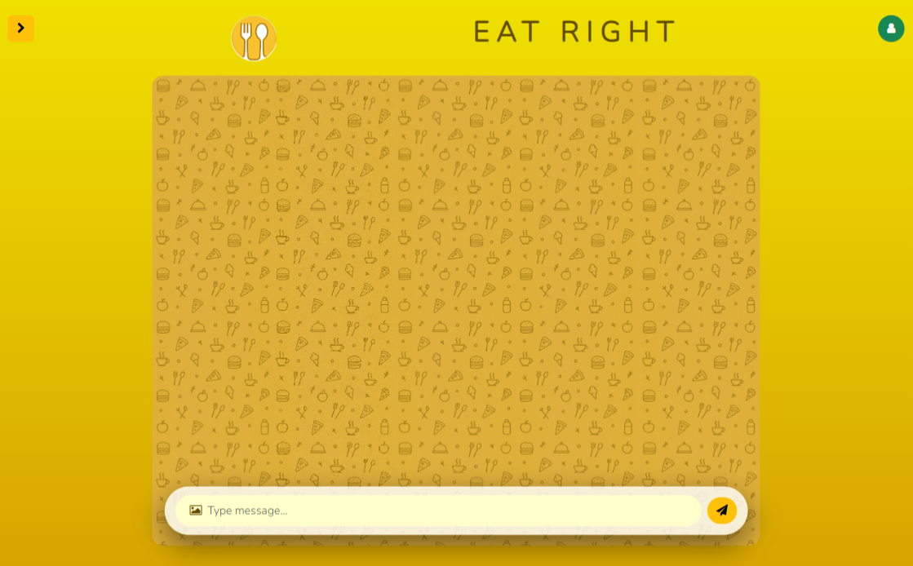
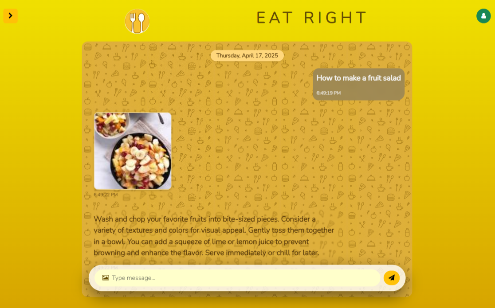
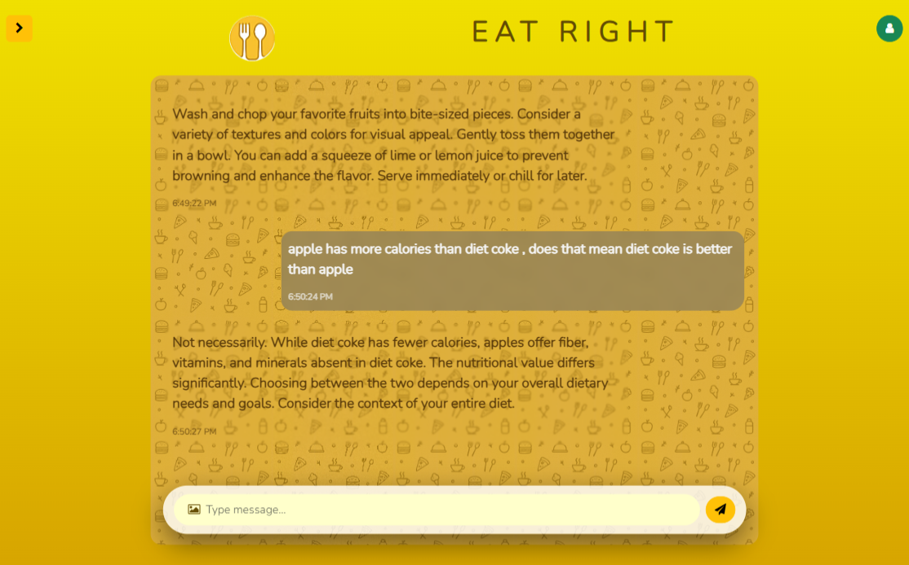
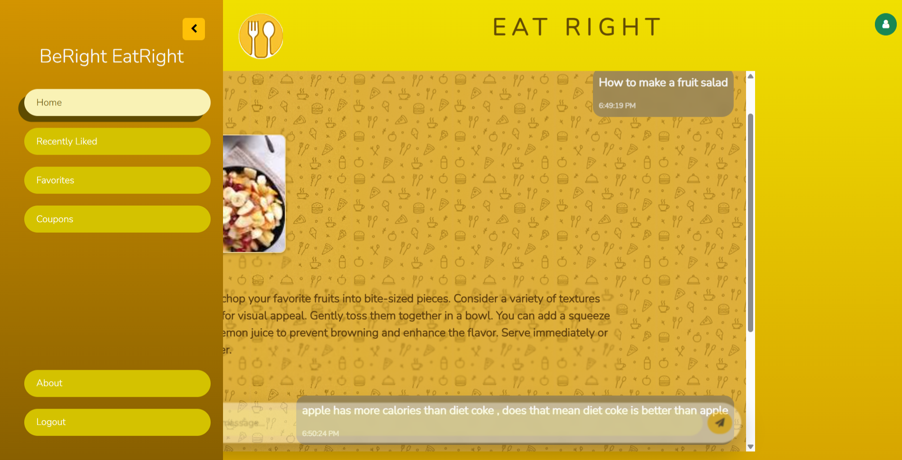

# 🍽️ AI Food Chatbot

EatRight : AI Food Assistant

---

## 📝 Description

This AI-powered food chatbot which can solve people doubts regarding to food , solve queries , ask question , upload a image for recognition , ask for a dish and AI response with image

---

## 🔧 Tech Stack Used

- **Frontend**: HTML, CSS, JavaScript
- **Backend**: Python (Django , channls)
- **AI Model**: Google Gemma
- **Database**: MySQL

---

## ⚙️ How Does It Work (Architecture)

1. The user interacts with a simple and clean UI where they can type food-related queries.
2. The frontend captures this query and sends it to the backend through an API.
3. The backend processes the query and constructs a prompt for the AI model.
4. The AI model (like LLaMA or any pretrained model) analyzes the input and generates a relevant food recommendation or description.
5. The backend receives the AI's response and may fetch additional data from the database if required (e.g., dish details, images).
6. The response is sent back to the frontend and rendered on the user interface in an engaging format.

---

## 🖼️ Images

### 🔐 Login

### 🏠 Home

### 📚 Sidebar

---

Feel free to clone, fork, or contribute to this project!

---
